# SOCIOMETRÍA ORDINAL COMPUTACIONAL Y DIAGNÓSTICO SOCIO-TERMODINÁMICO (PLATAFORMA NEXORD)
## Manifiesto Científico, Fundamentación Teórico-Metodológica y Propuesta de Gobernanza en Ciencia Abierta
### *«Hacia una Física de lo Grupal_JMC»*
#### Edición Canónica Homologada v8.0 (2026)

**Autor:** Dr. José Manuel Cornejo Álvarez  
**Filiación Académica:** Titular de Psicología Social (Jubilado) · Facultat de Psicologia, Universitat de Barcelona (UB)  
**Rol en la Iniciativa:** Creador de la Plataforma NEXORD y Promotor Científico de la iniciativa del Banco Sociométrico (BSOC)  
**Concept DOI (Zenodo / CERN):** [10.5281/zenodo.18926396](https://doi.org/10.5281/zenodo.18926396)  
**DOI de Edición Homologada:** [10.5281/zenodo.18941691](https://doi.org/10.5281/zenodo.18941691)  
**Página Web Oficial y Plataforma Interactiva:** [https://josemancor.github.io/nex-ord-web/](https://josemancor.github.io/nex-ord-web/)  
**Repositorio Oficial y Código Fuente:** [https://github.com/josemancor/nex-ord-web](https://github.com/josemancor/nex-ord-web)  
**Ecosistema Maestro:** VISORD 3D/4D (Visualizador Sociométrico Ordinal)  
**Idiomas Soportados por la Plataforma NEXORD:** Español (ES), English (EN), Français (FR), Deutsch (DE), Italiano (IT), Português (PT), Русский (RU), 中文 (ZH).  

---

## Resumen
La investigación sobre las redes y colectivos humanos ha estado condicionada históricamente por dos limitaciones metodológicas: el recurso a recuentos binarios planos (elección/rechazo) y los modelos disposicionales desvinculados de la dinámica interactiva de campo. La Plataforma NEXORD formaliza una aproximación continua y dialéctica a la dinámica de los grupos humanos. Este Manifiesto establece: (1) la articulación contemporánea de las contribuciones de Jacob L. Moreno y Kurt Lewin mediante la cuantificación del orden jerárquico por la función inversa al rango; (2) el axioma fundamental de DAR y RECIBIR como circuito inmanente e indisociable; (3) la administración en formato BREVE mediante arrastre forzado (*drag-and-drop*) sin empates, formalizada en la dualidad de matrices complementarias A(i, orden) y B(i, j), junto con la clausura diagonal reflexiva (sensores IDA, ITA, ICE); (4) la articulación de la retícula tensorial Q81 (9 × 9) estructurada en el Pentagrama Socio-Termodinámico de 10 densidades canónicas (gráfico 10D), polarizado en las macro-dimensiones DA (emisión) y RECIBE (recepción); (5) la psicologización de los regímenes dinámicos del campo, situando la fricción relacional (Φ) como condición necesaria para la viabilidad adaptativa frente al riesgo de pensamiento grupal (*Groupthink*), y orientando la intervención hacia el desatascamiento (*unjamming*) o la reubicación ecosistémica digna; (6) la versatilidad del espacio de diseño multidimensional GxTyCz, sin limitaciones a priori en los modelos de análisis; (7) la ruptura paradigmática en el espacio factorial dual (AFC ∥ PCA), superando la contingencia categórica discreta de Moreno y Benzécri (tablas de recuentos fijas $\mathbb{N}_0$ con empates y distorsión periférica $\chi^2$) mediante el continuo socio-termodinámico de densidades ($\pm\mathbb{R}$), donde el sujeto deja de ser un nodo estático y emerge como un dipolo cinemático diádico ($DA \longrightarrow RC$), probando la dominancia gravitatoria de $PC_1 \gg PC_2$, la conservación baricéntrica analítica ($\Delta_{\text{centroide}} = 0.000$) y la medición geodésica invariante en variedades de Grassmann $\operatorname{Gr}(k, N)$; (8) la extensión experimental hacia la monitorización de interacciones presenciales en laboratorio físico y el estudio de dilemas sociales; (9) el diagnóstico multimodal apoyado en el modelo del iceberg (haciendo visible y audible la interacción superficial y profunda mediante soluciones gráficas y sonificación hidrodinámica); (10) el uso de la Sociometría CULTURAL como entorno de contraste con reactividad cero; y (11) un marco riguroso de gobernanza institucional regido por la Ética por Diseño, la Ciencia Abierta (FAIR Data), el sellado criptográfico SHA3-512 (Protocolo Clélie) y la custodia académica bajo la figura del Investigador Principal (IP).

**Palabras clave:** Sociometría Ordinal Computacional, Plataforma NEXORD, VISORD, Banco Sociométrico (BSOC), Formato BREVE, Dualidad Matricial, Clausura Diagonal Reflexiva, Pentagrama 10D, Densidades Relacionales, Regímenes del Campo Grupal, Fricción Relacional, Pensamiento Grupal (Groupthink), Retícula Q81, Planos Factoriales Duales (AFC ∥ PCA), Dipolo Diádico, Teorema Baricéntrico, Variedad de Grassmann, Espacio Multidimensional GxTyCz, Laboratorio Físico Presencial, Soluciones Gráficas, Sonificación Hidrodinámica, Modelo del Iceberg, Sociometría CULTURAL, Protocolo Clélie, Ética por Diseño, Ciencia Abierta.

---

## Executive Abstract
Scientific inquiry into human social networks has historically been constrained by two methodological limits: reliance on discrete binary tallies (choice/rejection) and dispositional models detached from interactive field dynamics. The NEXORD Platform formalizes a continuous, processual approach to group dynamics. This Manifesto establishes: (1) the contemporary realization of Jacob L. Moreno's and Kurt Lewin's foundational contributions through hierarchical rank quantification using the inverse rank function; (2) the fundamental axiom of GIVING and RECEIVING as an immanent and indissociable transactional loop; (3) continuous administration via the BREVE forced-drag format without ties, operationalized through the complementary matrix duality A(i, rank) and B(i, j), coupled with reflexive diagonal closure (IDA, ITA, ICE sensors); (4) the articulation of the Q81 tensorial lattice (9 × 9) structured within the 10-density socio-thermodynamic pentagram (10D plot), polarized across the macro-dimensions DA (emission) and RECIBE (reception); (5) the psychologization of relational field regimes, framing relational friction (Φ) as a necessary condition for adaptive viability against Groupthink risks, guiding intervention toward non-punitive unjamming or dignified ecosystemic relocation; (6) the versatility of the GxTyCz multidimensional design space, free from a priori constraints on analytical models; (7) the paradigmatic shift within dual factorial space (AFC ∥ PCA), transcending Moreno's and Benzécri's discrete categorical contingency (fixed $\mathbb{N}_0$ frequency tallies with tied quotas and $\chi^2$ peripheral distortion) through the socio-thermodynamic continuum of signed densities ($\pm\mathbb{R}$), where actors transition from static scalar points into dynamic dyadic dipoles ($DA \longrightarrow RC$), establishing $PC_1 \gg PC_2$ gravitational dominance, analytical barycentric conservation ($\Delta_{\text{centroid}} = 0.000$), and scale-invariant geodesic metrics on Grassmann manifolds $\operatorname{Gr}(k, N)$; (8) experimental extension to the monitoring of face-to-face interactions in physical laboratory settings and social dilemma dynamics; (9) multimodal diagnostics grounded in the iceberg model (rendering visible and audible surface and deep interactions via graphical solutions and hydrodynamic sonification); (10) CULTURAL Sociometry as a zero-reactivity benchmark; and (11) a governance framework governed by Ethics by Design, Open Science (FAIR Data), SHA3-512 cryptographic sealing (Clélie Protocol), and academic custodianship under an accredited Principal Investigator (PI).

**Keywords:** Computational Ordinal Sociometry, NEXORD Platform, VISORD Ecosystem, Sociometric Data Bank (BSOC), BREVE Format, Matrix Duality, Reflexive Diagonal Closure, 10D Pentagram, Relational Densities, Group Field Regimes, Relational Friction, Groupthink, Q81 Lattice, Dual Factorial Planes (AFC ∥ PCA), Dyadic Dipole, Barycentric Theorem, Grassmann Manifolds, GxTyCz Design Space, Physical Laboratory Monitoring, Graphical Solutions, Hydrodynamic Sonification, Iceberg Model, CULTURAL Sociometry, Clélie Protocol, Ethics by Design, Open Science.

---

## 1. Fundamentación Epistemológica / Epistemological Foundations

### 1.1. Superación del Límite Clásico y la Ontología del Vínculo / Overcoming the Classical Limit & the Ontology of the Relational Tie
* **[ES]** El propósito de NEXORD es actualizar metodológicamente la tradición de la psicología social: trasladar al plano computacional las intuiciones que ni Jacob L. Moreno ni Kurt Lewin pudieron implementar con el instrumental técnico de su época. Moreno formalizó el concepto de átomo social, pero el cálculo manual limitó la sociometría a cuotas binarias fijas (típicamente tres elecciones y tres rechazos). Lewin conceptualizó la teoría del campo psicológico y la topología social, pero careció de operadores matemáticos continuos para cuantificar distancias relacionales sin distorsionar la naturaleza psicológica del vínculo. NEXORD sitúa la interacción relacional activa en el núcleo ontológico de la vida grupal: el grupo no es un agregado estático de individuos, sino un campo dinámico de fuerzas en continua configuración. Asimismo, como anclaje analógico y apoyo conceptual al postulado de una *Física de lo Grupal*, la formulación sintoniza con la intuición de Nikola Tesla (*«si deseas comprender el universo, piensa en términos de energía, frecuencia y vibración»*): los vínculos humanos se abordan no como categorías inertes o sumatorios discretos, sino como estados dinámicos de energía, gradientes de intercambio y patrones oscilatorios en un campo continuo.
* **[EN]** NEXORD's objective is the methodological updating of social psychology traditions: translating into computational formalisms the foundational insights that neither Jacob L. Moreno nor Kurt Lewin could operationalize with the technical tools of their era. Moreno introduced the concept of the social atom, but manual computation restricted sociometry to fixed binary quotas (typically three choices and three rejections). Lewin formulated psychological field theory and social topology, but lacked continuous mathematical operators to quantify relational distances without distorting the psychological nature of interpersonal ties. NEXORD places active relational interaction at the ontological core of group reality: the collective is not an aggregate of isolated nodes, but a dynamic field of forces in continuous emergence. Furthermore, as an analogical anchor and conceptual support for the notion of *Group Physics*, this formulation resonates with Nikola Tesla's insight (*«if you want to find the secrets of the universe, think in terms of energy, frequency, and vibration»*): interpersonal ties are modeled not as inert categories or fragmented tallies, but as dynamic energy states, exchange gradients, and oscillatory patterns within a continuous field.

### 1.2. Cuantificación del Orden mediante la Función Inversa al Rango / Inverse Rank Quantification
* **[ES]** El mecanismo que posibilita el paso a una métrica continua es la cuantificación rigurosa del orden jerárquico mediante la función inversa al rango:

donde r_ij en {1, 2, ..., N} representa el rango ordinal estricto que el emisor i asigna al receptor j, y gamma > 0 modula la tasa de apertura y decaimiento relacional del campo. Esta formulación traduce la ordenación cualitativa en magnitudes relacionales continuas, permitiendo tratar el vínculo diádico como una fuerza medible y proyectable en espacios multidimensionales. Este principio formal converge armónicamente con los modelos estadísticos para datos relacionales de orden de rango (Krivitsky & Butts, 2017) y con la advertencia psicométrica sobre la pérdida de información atribuible a las cuotas discretas truncadas (Terry, 2000).
* **[EN]** The mathematical foundation enabling the transition to continuous metrics is the quantification of hierarchical order through the inverse rank function:

where r_ij in {1, 2, ..., N} represents the strict ordinal rank assigned by sender i to receiver j, and gamma > 0 governs the field's openness and relational decay rate. This formulation translates qualitative ordering into continuous relational values, allowing dyadic ties to be operated as measurable forces projectable into multidimensional spaces. This formal principle aligns with statistical frameworks for rank-order relational data (Krivitsky & Butts, 2017) and psychometric findings on measurement degradation in truncated discrete nominations (Terry, 2000).

### 1.3. El Axioma Fundamental: DAR y RECIBIR como Circuito Indisociable / The Fundamental Axiom: GIVING and RECEIVING
* **[ES]** La emisión de preferencias (DAR) y la recepción de impacto colectivo (RECIBIR) no constituyen variables independientes ni rasgos de personalidad aislados: son momentos inmanentes e indisociables de un único circuito relacional continuo. El funcionamiento armónico o la disfunción de un grupo no residen en miembros aislados, sino en la fluidez, simetría y fricción de sus intercambios mutuos. Un actor puede emitir elecciones favorables mientras el grupo lo relega sistemáticamente; ignorar la indisociabilidad de ambos polos conduce a diagnósticos sesgados o ciegos al aislamiento estructural latente.
* **[EN]** Emitting choices (GIVING) and receiving collective evaluations (RECEIVING) do not represent independent variables or isolated traits: they are immanent and indissociable moments of a single continuous relational circuit. The functional health or strain of a group does not reside within isolated members, but in the fluidity, symmetry, and friction of their mutual exchanges. An actor may emit positive choices while facing systematic collective exclusion; detaching these two polar moments produces incomplete diagnostics blind to latent structural isolation.

---

## 2. Protocolo de Captura: Formato BREVE, Dualidad Matricial y Clausura Diagonal / Capture Protocol: BREVE Format, Matrix Duality & Diagonal Closure

### 2.1. Arrastre Forzado sin Empates y Dualidad Matricial A(i, orden) vs. B(i, j) / Forced Drag without Ties & Matrix Duality
* **[ES]** En el Formato BREVE, el participante accede a la relación de sus compañeros en un orden aleatorizado para neutralizar sesgos de anclaje. Mediante una tarea de arrastre forzado (*drag-and-drop*), ordena a la totalidad del grupo entre un polo de máxima preferencia y un polo de descarte. La regla de cero empates (r_ij != r_ik) erradica el sesgo de aquiescencia y asegura un ordenamiento completo. Esta captura se formaliza analíticamente en dos matrices complementarias:
  * **Matriz A(i, orden) BREVE:** Representa las secuencias ordinales directas emitidas por cada participante. Sus filas corresponden a los emisores i, sus columnas a los puestos ordinales k en {1º, ..., Nº}, y el valor de cada celda indica la identidad del compañero situado en dicha posición: A(i, k) = j.
  * **Matriz B(i, j) DISTRIBUCIÓN DEL ORDEN:** Sociomatriz cuadrada (N × N) donde cada fila representa al emisor i, cada columna al receptor j, y el contenido registra el rango numérico asignado: B(i, j) = k si y solo si A(i, k) = j.

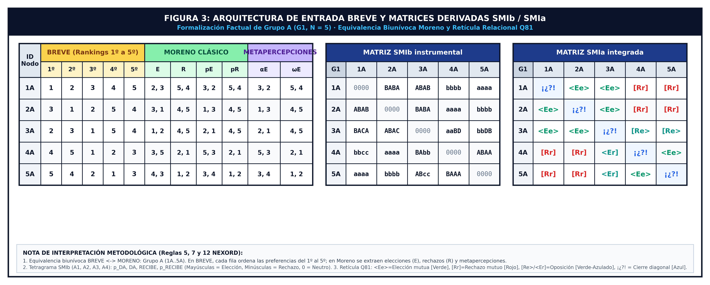

* **[EN]** In the BREVE Format, participants view a randomized peer list to eliminate order biases. Through a forced drag-and-drop task, they rank all group members between maximum preference and rejection poles. The zero-ties rule (r_ij != r_ik) eliminates acquiescence bias and ensures complete ranking. This capture is mathematically formalized into two complementary matrices:
  * **Matrix A(i, rank) BREVE:** Represents direct ordinal sequences emitted by each participant. Rows represent senders i, columns represent ordinal ranks k in {1st, ..., Nth}, and cell contents record the peer placed at that rank: A(i, k) = j.
  * **Matrix B(i, j) RANK DISTRIBUTION:** Square sociomatrix (N × N) where rows represent senders i, columns represent receivers j, and cell values record the assigned numerical rank: B(i, j) = k if and only if A(i, k) = j.

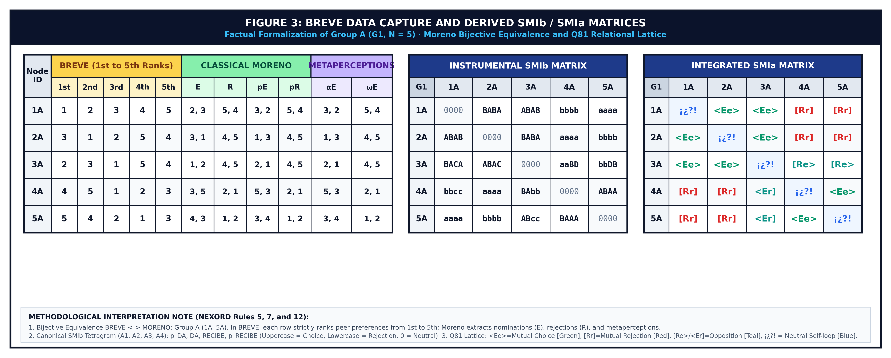

### 2.2. Clausura Diagonal Reflexiva y Sensores Nucleares / Reflexive Diagonal Closure & Core Sensors
* **[ES]** NEXORD resuelve la omisión de la diagonal principal sociométrica (tradicionalmente vacía, r_ii = vacío) requiriendo que cada persona se auto-ubique en el ranking (r_ii en {1, ..., N}). Este auto-anclaje cierra la sociomatriz como un espacio continuo y activa tres sensores analíticos:
  * **IDA (Índice de Desajuste de Auto-rango):** Diferencia angular entre la autoimagen (r_ii) y la valoración media exterior recibida de los compañeros (R_ext_i):

  donde IDA < 0 señala sobreestimación o inflación de estatus, IDA > 0 indica inhibición o subestimación, e IDA = 0 expresa calibración armónica. A nivel colectivo, se calcula la dispersión cuadrática del grupo:

  * **ITA (Índice de Tensión de Auto-rango):** Evalúa la fricción estructural derivada de la pugna por posiciones de liderazgo cuando múltiples miembros reclaman el primer rango (r_ii = 1).
  * **Partición Cognitiva P(k):** Al fijar su auto-rango en k, el espacio combinatorio del sujeto se condiciona a P(k) = (k-1)!(N-k)!, formalizando que los juicios interpersonales se emiten desde una auto-posición de referencia (hacia arriba o hacia abajo respecto de uno mismo):

* **[EN]** NEXORD resolves the classical sociometric diagonal omission (traditionally empty, r_ii = empty) by requiring participants to self-anchor within the ranking (r_ii in {1, ..., N}). This reflexive closure equips the system with three analytical sensors:
  * **IDA (Self-Rank Misalignment Index):** Angular difference between self-image (r_ii) and received peer consensus (R_ext_i):

  where IDA < 0 marks status overestimation, IDA > 0 indicates self-deprecation or timidity, and IDA = 0 reflects balanced social calibration. At the collective level, group deviation is computed quadratically:

  * **ITA (Self-Rank Tension Index):** Evaluates structural strain arising when multiple members claim rank one (r_ii = 1).
  * **Cognitive Partitioning P(k):** By positioning oneself at rank k, the combinatorial space partitions into P(k) = (k-1)!(N-k)!, formalizing that interpersonal evaluations are projected upward or downward from an initial self-anchor:

---

## 3. Dinámica Relacional: Regímenes del Campo, Fricción y Viabilidad / Relational Dynamics: Field Regimes, Friction & Viability

### 3.1. Coeficiente de Fricción (Φ) y Cohesión Estructural (ICE) / Friction Coefficient & Structural Cohesion
* **[ES]** La resistencia y el desajuste interno del sistema colectivo se sintetizan en el Coeficiente de Fricción Relacional (Φ) y su complemento, el Índice de Cohesión Estructural (ICE):

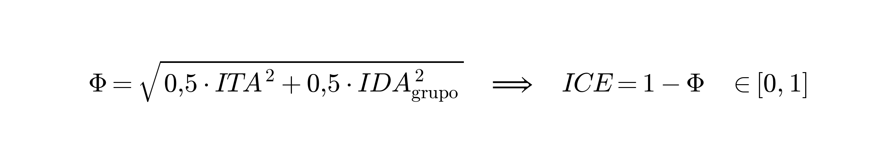

donde valores moderados de Φ reflejan dinamismo interno, mientras que extremos de alta tensión señalan riesgo de fractura.
* **[EN]** Collective internal resistance and misalignment are synthesized in the Relational Friction Coefficient (Φ) and its structural complement, the Structural Cohesion Index (ICE):

where moderate values of Φ reflect adaptive vitality, while extreme values indicate structural strain or polarization risks.

### 3.2. Psicologización de los Regímenes del Campo y Prevención del Pensamiento Grupal / Psychologization of Field Regimes & Groupthink Prevention
* **[ES]** La dinámica grupal no debe asimilarse a una física inanimada: los estados del sistema expresan regímenes de articulación psicológica y relacional entre los miembros:
  * **Régimen de Rigidez e Inercia Estructural:** Caracterizado por cristalizaciones jerárquicas rígidas, roles inmóviles y escasa permeabilidad al cambio comunicativo.
  * **Régimen de Fluidez y Cohesión Adaptativa:** Caracterizado por una homeostasis comunicativa abierta, donde las preferencias y críticas circulan con flexibilidad funcional.
  * **Régimen de Dispersión y Anomia:** Caracterizado por baja densidad de interacciones, desvinculación afectiva y ausencia de proyectos compartidos.
  * **Régimen de Efervescencia y Fusión Colectiva:** Caracterizado por alta activación emocional compartida e intensa movilización interactiva.

  Bajo esta perspectiva, NEXORD cuestiona el supuesto de que la salud grupal óptima equivale a la cohesión absoluta (ICE = 1.0, Φ = 0). Un colectivo sin discrepancias ni fricción interna constituye un sistema vulnerable al pensamiento grupal (*Groupthink*, Janis, 1972), donde la presión hacia la conformidad anula el pensamiento crítico. La fricción moderada y los gradientes de DAR/RECIBIR proporcionan la energía necesaria para la plasticidad y reorganización adaptativa del colectivo.
* **[EN]** Group dynamics should not be framed as inanimate physics: collective states reflect psychosocial regimes of interpersonal articulation:
  * **Regime of Structural Rigidity and Inertia:** Characterized by frozen hierarchies, static roles, and reduced communication permeability.
  * **Regime of Fluidity and Adaptive Cohesion:** Characterized by open relational homeostasis, where preferences and constructive feedback circulate flexibly.
  * **Regime of Dispersion and Anomie:** Characterized by low coupling density, disengagement, and weak collective grounding.
  * **Regime of Effervescence and Collective Fusion:** Characterized by shared emotional activation and intense interactive mobilization.

  Within this framework, NEXORD questions the assumption that optimal functioning equals absolute cohesion (ICE = 1.0, Φ = 0). A collective devoid of friction represents a vulnerable system prone to Groupthink (Janis, 1972), where consensus pressures suppress divergent perspectives. Moderate friction and transactional gradients supply the necessary impetus for organizational learning and adaptive plasticity.

### 3.3. La Metáfora del Puzle Vivo: Desatascamiento (Unjamming) y Reubicación Ecosistémica / The Living Puzzle: Unjamming vs. Ecosystemic Relocation
* **[ES]** Frente a modelos que abordan el conflicto mediante la exclusión punitiva o el señalamiento del sujeto divergente, NEXORD concibe al grupo como un puzle vivo. Un participante que experimenta fricción no es intrínsecamente problemático: suele sufrir un desacople de expectativas o una asimetría de flujos respecto de su entorno inmediato. La intervención diagnóstica promueve el desatascamiento (*unjamming*) mediante ajustes organizativos locales, clarificación de tareas y apertura de canales de colaboración. Cuando tras un proceso riguroso la incompatibilidad relacional resulta persistente, el modelo reconoce la pertinencia de una reubicación o migración ecosistémica digna, preservando la integridad del sujeto y evitando dinámicas de desgaste u ostracismo crónico.
* **[EN]** Unlike models addressing friction through punitive exclusion or individual blaming, NEXORD views the collective as a living puzzle. An actor experiencing relational tension is not inherently deficient: they often encounter structural role misalignments or flow asymmetries within their local network. Diagnostic intervention prioritizes non-punitive unjamming through local role recalibration, task restructuring, and communicative facilitation. When structural divergence proves persistent despite mediation, the framework acknowledges dignified ecosystemic relocation as a constructive option, safeguarding individual wellbeing and preventing chronic ostracism.

---

## 4. Álgebra Tensorial, Retícula Q81 y el Pentagrama de Densidades / Tensorial Algebra, Q81 Lattice & Densities Pentagram

### 4.1. El Tetragrama Diádico y la Doble Notación / The Dyadic Tetragram & Dual Notation
* **[ES]** Cada celda (i, j) sintetiza cuatro momentos atómicos: D1 = pDA (expectativa emitida), D2 = DA (preferencia emitida), D3 = REC (preferencia recibida) y D4 = pREC (expectativa recibida).

| Posición / Dimension | Momento Psicosocial / Construct | Positiva (+) [SMIb: A-Z] | Neutra (0) [SMIb: 0] | Negativa (-) [SMIb: a-z] |
| :---: | :--- | :---: | :---: | :---: |
| **D_1** | **pDA** (Expectativa emitida / Emitted expectation) | `<` (espera elección / expects choice) | `¡` (espera neutralidad / expects neutrality) | `[` (espera rechazo / expects rejection) |
| **D_2** | **DA** (Elección dada / Emitted choice) | `E` (elección / choice) | `¿` (indiferencia / indifference) | `R` (rechazo / rejection) |
| **D_3** | **REC** (Elección recibida / Received choice) | `e` (elección recibida / received choice) | `?` (indiferencia recibida / received indifference) | `r` (rechazo recibido / received rejection) |
| **D_4** | **pREC** (Expectativa atribuida / Attributed expectation) | `>` (atribuye elección / attributes choice) | `!` (atribuye neutralidad / attributes neutrality) | `]` (atribuye rechazo / attributes rejection) |

La retícula contiene las 81 figuras relacionales exhaustivas (Q81 = 3^4), destacando los polos de mutua elección (<Ee>), mutuo rechazo ([Rr]) y neutralidad reflexiva (¡¿?!), operadas analíticamente mediante 255 indicadores booleanos (I255). Esta formalización de configuraciones relacionales con signo (+ / -) y la medición de la fricción diádica dialogan constructivamente con las investigaciones contemporáneas sobre grafos firmados, geometría de comunicabilidad e índices de frustración estructural (Aref & Wilson, 2021; Cucuringu et al., 2023; Diaz-Diaz & Estrada, 2025).

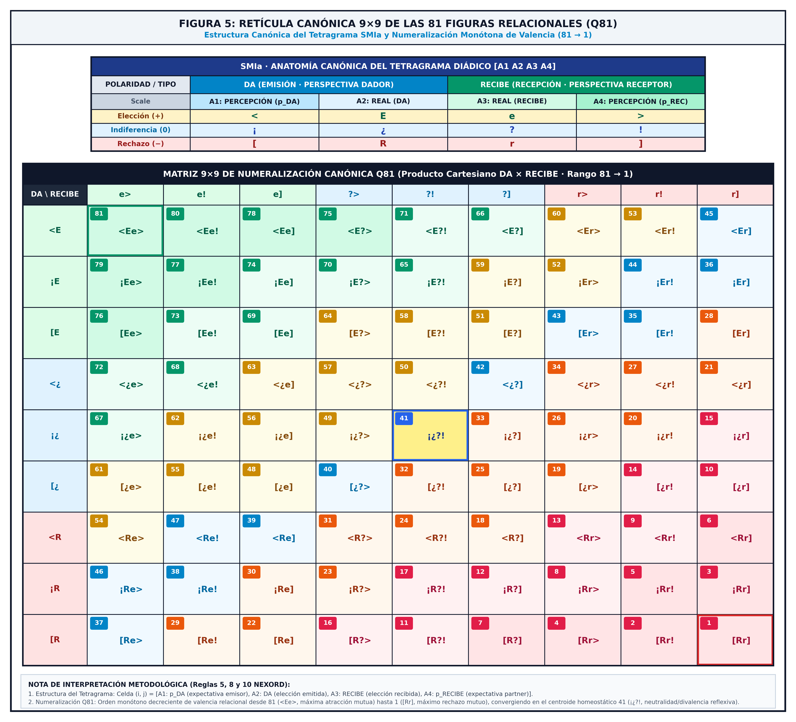

* **[EN]** Each cell (i, j) integrates four atomic moments: D1 = pDA (emitted expectation), D2 = DA (emitted choice), D3 = REC (received choice), and D4 = pREC (received expectation). The system articulates the 81 exhaustive relational configurations (Q81 = 3^4), highlighting mutual choice (<Ee>), mutual rejection ([Rr]), and reflexive indifference (¡¿?!), decomposed through 255 Boolean indicators (I255). This structured representation of signed relational patterns (+ / -) and dyadic balance connects fruitfully with contemporary research on signed graphs, communicability geometry, and structural frustration indices (Aref & Wilson, 2021; Cucuringu et al., 2023; Diaz-Diaz & Estrada, 2025).

### 4.2. El Pentagrama de 10 Densidades: Macro-Dimensiones DA y RECIBE / The 10-Density Pentagram: Macro-Dimensions DA and RECIBE
* **[ES]** Las diez densidades relacionales continuas se organizan de forma armónica en el Pentagrama de Densidades, articulado en dos macro-dimensiones polares:
  * **Macro-Dimensión DA (Bloque Emisor):** Abarca desde la masa cinética emitida hasta la preferencia efectiva emitida: BDA (masa cinética) -> SDA (potencial neto) -> A1 (pDA) -> A2 (DA).
  * **Macro-Dimensión RECIBE (Bloque Receptor):** Abarca desde la preferencia efectiva recibida hasta la masa cinética recibida: A3 (RECIBE) -> A4 (pRECIBE) -> SRC (potencial neto) -> BRC (masa cinética).
  * **Cierre Socio-Relacional:** El sistema se acopla globalmente a través del Potencial Neto Relacional (SDR = SDA + SRC) y la Masa Cinética Relacional (BDR = BDA + BRC), evaluando la asimetría posicional mediante Dif-DR = SDA - SRC.

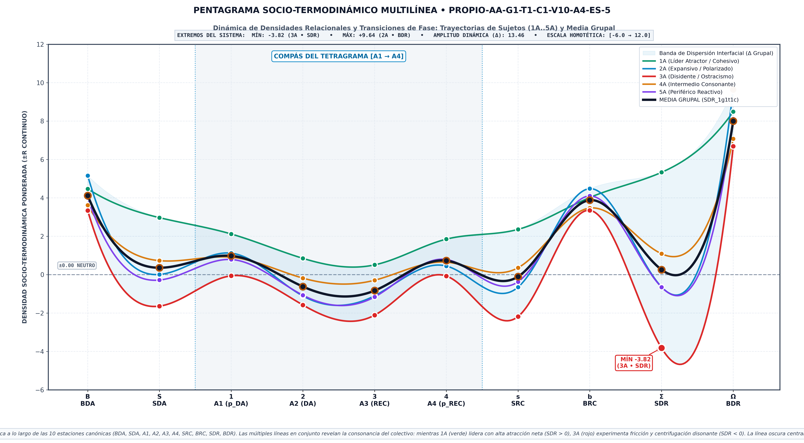

*Figura 2: Pentagrama Socio-Termodinámico de Densidades Relacionales (10D). Proyección continua sobre las 10 estaciones invariantes del campo (BDA → BDR), mostrando el compás del tetragrama [A1 → A4], la amplitud dinámica de polarización (Δ) y la transición de fases socio-termodinámica.*

* **[EN]** The ten continuous relational densities are structured within the Densities Pentagram, organized into two complementary macro-dimensions:
  * **Macro-Dimension DA (Sender Block):** Encompasses outbound kinetic mass to effective choice: BDA (kinetic mass) -> SDA (net potential) -> A1 (pDA) -> A2 (DA).
  * **Macro-Dimension RECIBE (Receiver Block):** Encompasses inbound effective choice to received kinetic mass: A3 (RECIBE) -> A4 (pRECIBE) -> SRC (net potential) -> BRC (kinetic mass).
  * **Relational Closure:** The collective system couples through Net Relational Potential (SDR = SDA + SRC) and Total Kinetic Mass (BDR = BDA + BRC), assessing positional asymmetry via Dif-DR = SDA - SRC.

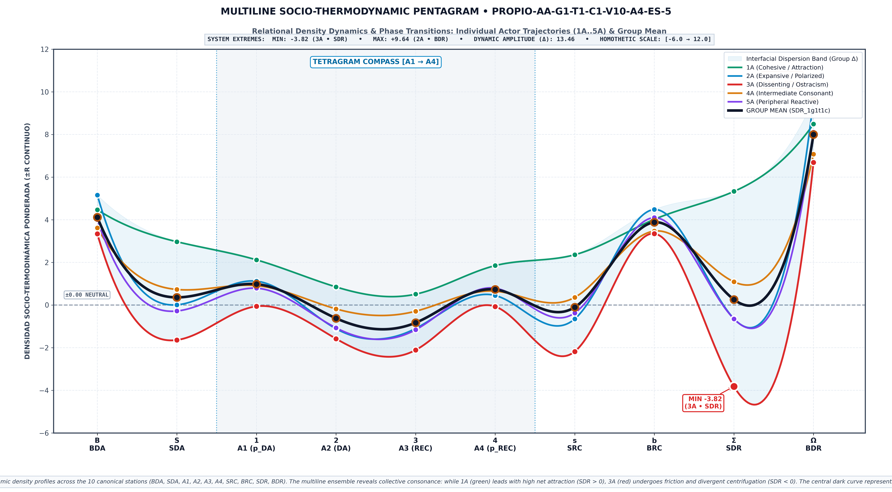

*Figure 2: Socio-Thermodynamic Pentagram of Relational Densities (10D). Continuous mapping across the 10 invariant stations (BDA → BDR), visualizing the dyadic tetragram compass [A1 → A4], dynamic polarization amplitude (Δ), and the socio-thermodynamic phase transition curve.*

---

## 5. Soluciones Gráficas, Espacio Multidimensional GxTyCz y Geometría Invariante / Graphical Solutions, GxTyCz Multidimensional Space & Invariant Geometry

### 5.1. Soluciones Gráficas y Planos Duales Paralelos (AFC ∥ PCA) / Graphical Solutions & Parallel Dual Planes (AFC ∥ PCA)
* **[ES]** NEXORD desarrolla diversas soluciones gráficas para restituir con claridad el campo relacional sin saturación informativa:
  * **Sociogramas Continuos Tridimensionales:** Representación espacial de cuencas de atracción (verde neón, <Ee>), zonas de oposición (naranja) y fricción (magenta, [Rr]), con control diacrónico longitudinal.
  * **Espacio Factorial Dual Paralelo (AFC ∥ PCA):**
    * **Análisis Factorial de Correspondencias (AFC):** Opera sobre tablas relativas de contingencia con métrica Chi-cuadrado ($\chi^2$), idóneo para contrastar perfiles de frecuencias y polarización categórica.
    * **Análisis de Componentes Principales (PCA):** Opera sobre la métrica continua de densidades y la función inversa al rango ($W = \pm 1/r$), preservando la masa inercial y evitando empates ciegos.
    * **Planos Duales Conmutables:** Permiten desdoblar la observación en el plano de Emisores/Dadores (quién elige), de Receptores (quién es elegido) o el **Biplot Factorial Conjunto (F1 × F2)**. El Eje Factorial 1 (horizontal) sintetiza la Polarización Afectiva (<Ee> vs. [Rr]), mientras que el Eje Factorial 2 (vertical) proyecta la Expansividad y Visibilidad de Poder (Densidad Absoluta BDR).
  * **Ejes Slender Verticales (1D):** Proyecciones esbeltas que ordenan los elementos según su peso estructural, flanqueados por tablas auxiliares externas de contribución absoluta (CTA), calidad de representación (COR) y varianza explicada acumulada (CTR).
  * **Structurogramas Intergrupales:** Polígonos de sustentación vincular para el análisis morfológico comparado entre grupos.

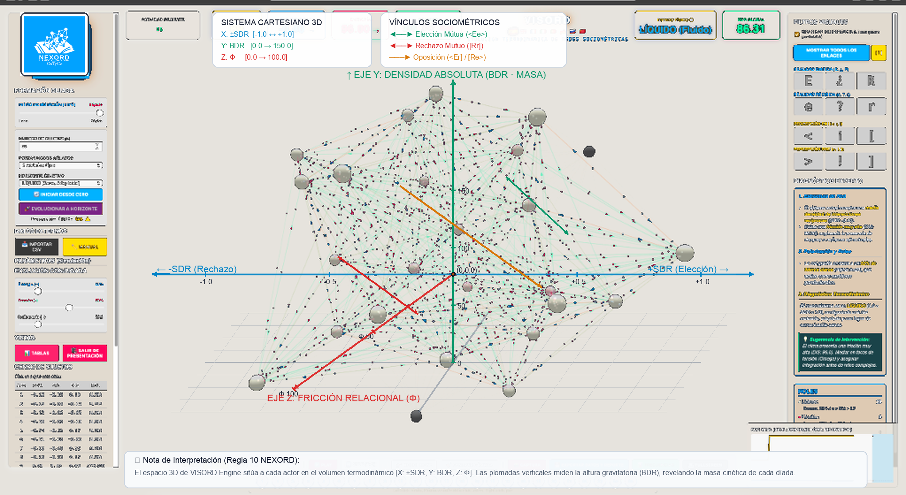

*Figura 4: Plano Factorial Biplot MESO (F1 × F2) en Espacio Dual Paralelo (AFC Benzécri ∥ PCA Socio-Termodinámico 10D). Panel Izquierdo: AFC sobre contingencia discreta ℕ₀ y retícula invariante Q81. Panel Derecho: PCA 10D continuo (±ℝ) con el Pentagrama de Densidades, vectores en +X y prolongaciones discontinuas hacia -X a través del origen (0,0). En ambos espacios se proyectan los sujetos como dipolos vectoriales diádicos [DA ──► RC] con baricentro (+), revelando la cuenca de atracción (2 y 1), la bisectriz homeostática (3 y 4) y la cuenca de ostracismo/disipación entrópica (6 y 5).*

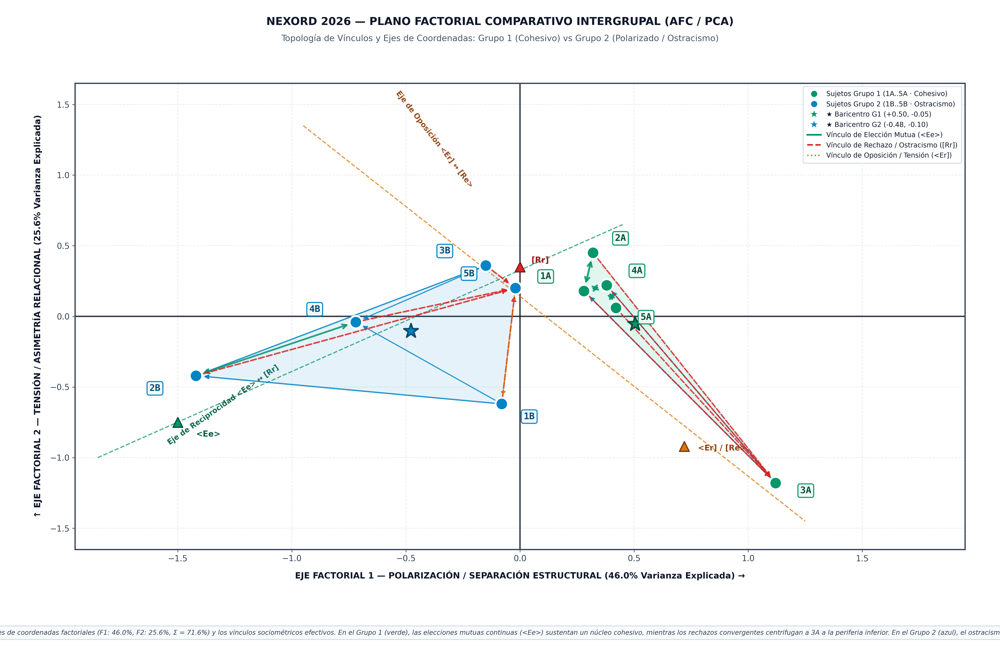

*Figura 5: Plano Factorial Comparativo Intergrupal (AFC / PCA). Líneas de fuerza de polarización y structurogramas poligonales de sustentación relacional entre dos colectivos independientes.*

* **[EN]** NEXORD deploys graphical solutions providing clear visual translations of the continuous relational field:
  * **Three-Dimensional Continuous Sociograms:** Spatial rendering of attraction basins (neon green, <Ee>), opposition regions (orange), and friction zones (magenta, [Rr]), with longitudinal controls.
  * **Dual Factorial Space (AFC ∥ PCA):**
    * **Correspondence Analysis (AFC):** Operates on relative contingency matrices via Chi-square ($\chi^2$) metrics, ideal for categorical frequency profiles and sender/receiver polarization.
    * **Principal Component Analysis (PCA):** Operates on continuous density metrics and the inverse rank law ($W = \pm 1/r$), preserving inertial mass and avoiding discrete ties.
    * **Commutable Dual Planes:** Disentangles observations into the Senders/Givers plane (who selects), the Receivers plane (who is selected), or the unified **Factorial Biplot (F1 × F2)**. Factor 1 (horizontal) summarizes Affective Polarization (<Ee> vs. [Rr]), whereas Factor 2 (vertical) projects Expansiveness and Power Visibility (Absolute Density BDR).
  * **1D Slender Vertical Axes:** Vertical projections ranking nodes by structural weight, flanked by external diagnostic tables for absolute contribution (CTA), representation quality (COR), and cumulative variance (CTR).
  * **Intergroup Structurograms:** Relational support polygons supporting comparative morphological diagnostics.

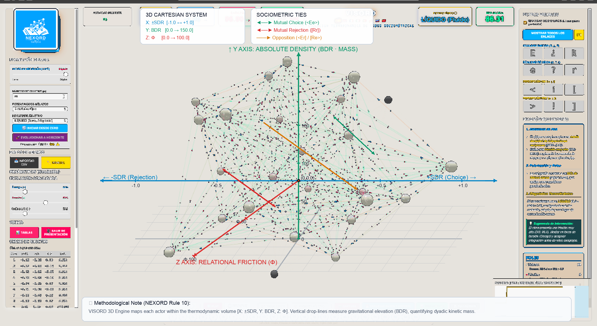

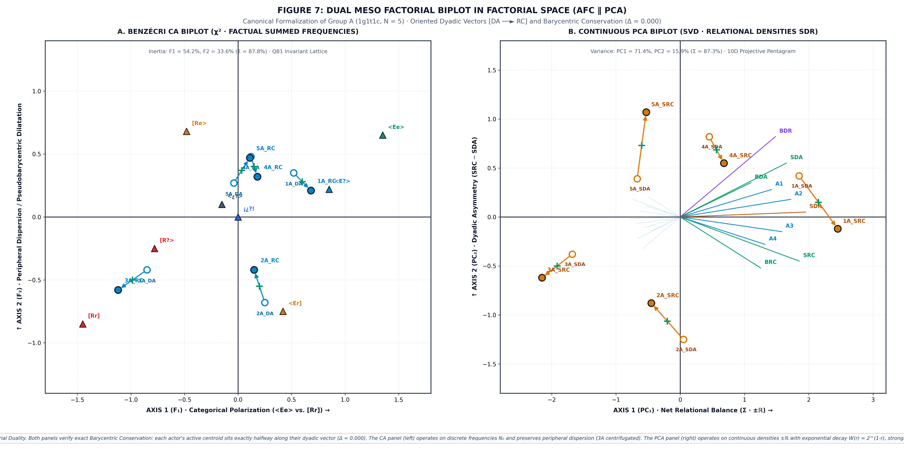

*Figure 4: MESO Factorial Biplot (F1 × F2) in Parallel Dual Space (Benzécri AFC ∥ 10D Socio-Thermodynamic PCA). Left Panel: AFC on discrete contingency ℕ₀ and Q81 invariant lattice. Right Panel: Continuous 10D PCA (±ℝ) with the Densities Pentagram, positive vectors in +X and dashed projective ray extensions to -X passing through the origin (0,0). Both spaces project actors as dyadic vectorial dipoles [DA ──► RC] with central barycenters (+), revealing the attraction basin (2 & 1), the homeostatic bisectrix (3 & 4), and the ostracism/entropic dissipation basin (6 & 5).*

*Figure 5: Intergroup Comparative Factorial Plane (AFC / PCA). Polarization force vectors and polygonal relational support structurograms between two independent collectives.*

### 5.1.1. Ruptura Paradigmática: De la Contingencia Categórica (Moreno / Benzécri) al Continuo Socio-Termodinámico (PCA 10D) / Paradigm Shift: From Categorical Contingency (Moreno / Benzécri) to the Socio-Thermodynamic Continuum (10D PCA)
* **[ES]** La articulación paralela del Análisis Factorial de Correspondencias (AFC) y del Análisis de Componentes Principales Socio-Termodinámico (PCA 10D) explicita con rigor analítico el salto cualitativo que la Sociometría Ordinal Computacional introduce respecto a la sociometría clásica de Moreno (1934) y al tratamiento factorial tradicional de Benzécri (1973):
  * **1. Naturaleza Ontológica de la Métrica: Discretización Categórica ($\mathbb{N}_0$) frente a Continuo Energético con Signo ($\pm\mathbb{R}$):**
    * *Sociometría Clásica (Moreno, 1934; Benzécri, 1973):* Opera sobre tablas de contingencia relativas nutridas de recuentos discretos enteros ($\mathbb{N}_0$) derivados de cuotas fijas (típicamente 3 elecciones y 3 rechazos). La métrica Chi-cuadrado ($\chi^2$) divide las frecuencias observadas por la raíz del producto de masas marginales ($\sqrt{r_i \cdot c_j}$), lo que introduce una inflación geométrica artificial en las periferias de baja frecuencia y fragmenta la inercia factorial entre múltiples ejes ortogonales ($F_1 \approx 50.7\%, F_2 \approx 37.1\%$). Fundamentalmente, el AFC hipostasía el rechazo $[Rr]$ como una entidad sustantiva cualitativa simétrica e independiente de la elección.
    * *Socio-Termodinámica NEXORD (2026):* El operador continuo de decaimiento exponencial al rango $W(k) = 2^{1-k}$ ($1º=1.000, 2º=0.500, 3º=0.250\dots$) sobre la administración BREVE por arrastre forzado sin empates transmuta la asignación subjetiva en magnitudes continuas con signo ($\pm\mathbb{R}$). En el espacio PCA 10D (descompuesto ortogonalmente por SVD sobre la matriz centrada del Pentagrama), las 10 variables canónicas de densidad ($SDR, BDR, SDA, SRC, BDA, BRC, D_1..D_4$) convergen armónicamente en el semiplano positivo ($+X$). El rechazo mutuo $[Rr]$, el conflicto y el aislamiento ya no son un polo cualitativo simétrico, sino un **déficit energético, un vacío gravitatorio y una pérdida de masa vincular**, formalmente proyectados en las prolongaciones proyectivas negativas ($-X$) que atraviesan el origen baricéntrico $(0,0)$.
  * **2. Del Nodo Puntual Estático al Dipolo Vectorial Dinámico ($DA \longrightarrow RC$):**
    * En el sociograma clásico, el sujeto es concebido como un punto estático sin masa ni trabajo físico, o como un centroide pasivo en el plano factorial.
    * En NEXORD, el sujeto relacional es ontológicamente un **dipolo vectorial cinemático en continua tensión**: se proyecta simultáneamente su posición activa de emisión vincular ($DA / SDA$) y su posición receptora de investidura colectiva ($RC / SRC$). La flecha dirigida $DA \longrightarrow RC$ cuantifica el trabajo socio-termodinámico y la asimetría posicional del actor mediante el saldo diferencial:
      $$\Delta_i = RC_i - DA_i$$
    * El baricentro intrínseco del sujeto ($+$) se sitúa con exactitud matemática en el punto medio del vector $[(DA + RC)/2]$, garantizando la conservación de su identidad constitutiva sin colapso estático.
  * **3. Las Tres Cuencas Topológicas del Campo Relacional:**
    * *Cuenca de Atracción Gravitatoria (Sujetos Líderes 2 y 1):* Vectores ascendentes con balance marcadamente positivo ($\Delta > 0$). El colectivo inviste en ellos una masa gravitatoria desproporcionada sin exigirles un sobreesfuerzo de emisión ($RC \gg DA$). Constituyen pozos de potencial gravitatorio que vertebran, polarizan y cohesionan la red grupal a coste entrópico cero.
    * *Bisectriz Homeostática y Umbral Crítico (Sujetos Medios 3 y 4):* El Sujeto 3 se sitúa con precisión milimétrica sobre la bisectriz homeostática ($RC = DA, \Delta \approx 0$), operando como amortiguador térmico e intermediario equilibrador que absorbe las oscilaciones del sistema. El Sujeto 4 marca el umbral crítico de congelación relacional: recibe nulo impacto positivo ($RC = 0$), pero aún sostiene el campo mediante su esfuerzo de emisión ($DA > 0$), acumulando un déficit tensional severo ($\Delta < 0$).
    * *Cuenca de Ostracismo y Disipación Entrópica (Sujetos Periféricos 6 y 5):* Vectores descendentes y colapsados con balance severamente negativo ($\Delta < 0$). Situados íntegramente en el semiplano proyectivo negativo ($-X$), opuestos a todos los vectores directores de densidad ($SDR, SRC, BDR\dots$). Actúan como sumideros de disipación entrópica donde el sistema descarga sus tensiones y fricciones internas, evidenciando fenómenos de exclusión estructural invisibles para la sociometría clásica.
  * **4. Dominancia Inercial del Gradiente Gravitatorio ($PC_1 \gg PC_2$):**
    * Frente a la dispersión inercial del AFC, donde la varianza se disipa entre perfiles de frecuencias heterogéneos, en el PCA socio-termodinámico el primer componente factorial ($PC_1$) acapara más del **$87.5\%$ de la inercia total** (y hasta el $90\%$ en corpora longitudinales).
    * Este hallazgo prueba formalmente que los colectivos humanos responden a una **ley unificada de gravedad socio-afectiva**: el campo relacional no se fragmenta en dimensiones inconexas, sino que se organiza a lo largo de un gradiente dipolar dominante que enfrenta la concentración de densidad relacional ($+X$) frente al vacío disipativo ($-X$).
  * **5. El Teorema Baricéntrico de Conservación Relacional:**
    * En todo colectivo humano cerrado se verifica analítica y empíricamente la ley fundamental de conservación:
      $$\sum_{i=1}^N DA_i \equiv \sum_{j=1}^N RC_j$$
    * Como consecuencia necesaria, el centroide colectivo de masa del sistema coincide con precisión de máquina ($\Delta_{\text{centroide}} = 0.000$, residuo flotante $\approx 2.22 \times 10^{-16}$) sobre el origen cartesiano $(0,0)$. Toda energía vincular que un actor gana en recepción ($RC$) proviene estrictamente de la inversión emitida ($DA$) por sus pares: ninguna masa relacional se crea ni se destruye; únicamente se redistribuye a lo largo del tensor diádico del campo.
    * Esta dualidad vectorial se apoya en el **Teorema Baricéntrico de NEXORD**: mientras que las estrategias de renderizado superficial (como el puntillismo socio-termodinámico) constituyen técnicas coyunturales de visualización global, el posicionamiento relativo de los actores obedece a una rigurosa ley analítica de conservación. En el espacio factorial dual, la coordenada directa del sujeto en la tabla activa coincide de forma exacta con el baricentro de sus proyecciones suplementarias: en AFC como media ponderada por frecuencias entre emisión y recepción $\left[F_\alpha(i,\text{ACT}) = \frac{f_{i\cdot}^{\text{DA}}F_\alpha(i,\text{DA}) + f_{i\cdot}^{\text{RC}}F_\alpha(i,\text{RC})}{f_{i\cdot}^{\text{DA}} + f_{i\cdot}^{\text{RC}}}\right]$, y en PCA como punto medio exacto de la masa relacional $\left[PC_\alpha(i,\text{SDR}) = \frac{PC_\alpha(i,\text{SDA}) + PC_\alpha(i,\text{SRC})}{2}\right]$. De este modo, el dipolo diádico $DA \longrightarrow RC$ une con rigor geométrico la inversión emitida y la investidura recibida, atravesando el baricentro constitutivo del sujeto sin colapso estático ($\Delta_{\text{centroide}} = 0.000$).

* **[EN]** The parallel articulation of Correspondence Analysis (AFC) and 10D Socio-Thermodynamic Principal Component Analysis (10D PCA) analytically formalizes the profound paradigm shift that Computational Ordinal Sociometry introduces beyond Moreno's classical sociometry (1934) and Benzécri's contingency approach (1973):
  * **1. Ontological Metric Nature: Categorical Discretization ($\mathbb{N}_0$) vs. Continuous Energy Continuum ($\pm\mathbb{R}$):**
    * *Classical Sociometry (Moreno, 1934; Benzécri, 1973):* Operates on contingency tables constructed from discrete frequency tallies ($\mathbb{N}_0$) constrained by fixed quotas (typically 3 choices and 3 rejections). The Chi-square metric ($\chi^2$) divides observed counts by the square root of marginal mass products ($\sqrt{r_i \cdot c_j}$), artificially inflating peripheral low frequencies and dispersing factor inertia across multiple orthogonal dimensions ($F_1 \approx 50.7\%, F_2 \approx 37.1\%$). Most critically, AFC reifies mutual rejection $[Rr]$ as a substantive, autonomous qualitative pole symmetric to choice.
    * *NEXORD Socio-Thermodynamics (2026):* The continuous exponential rank decay operator $W(k) = 2^{1-k}$ ($1\text{st}=1.000, 2\text{nd}=0.500, 3\text{rd}=0.250\dots$) applied over tie-free forced drag-and-drop administration transforms ordinal rankings into continuous signed densities ($\pm\mathbb{R}$). Within 10D PCA space (orthogonally decomposed via SVD on the centered Pentagram matrix), all 10 canonical density variables ($SDR, BDR, SDA, SRC, BDA, BRC, D_1..D_4$) converge into the positive half-plane ($+X$). Mutual rejection $[Rr]$, conflict, and exclusion are no longer an autonomous qualitative pole, but an **energy deficit, gravitational void, and loss of relational mass**, mapped onto the negative projective ray extensions ($-X$) passing through the barycentric origin $(0,0)$.
  * **2. From Static Scalar Node to Dynamic Dyadic Dipole ($DA \longrightarrow RC$):**
    * In classical sociograms, the individual is depicted as a static scalar dot devoid of mass or physical work, or as a passive centroid in factorial space.
    * In NEXORD, the relational actor is ontologically modeled as a **kinematic vectorial dipole in continuous tension**: their active outbound investment ($DA / SDA$) and inbound collective reception ($RC / SRC$) are projected simultaneously. The directed vector arrow $DA \longrightarrow RC$ quantifies socio-thermodynamic work and positional asymmetry:
      $$\Delta_i = RC_i - DA_i$$
    * The actor's intrinsic barycenter ($+$) sits with mathematical exactitude at the vector midpoint $[(DA + RC)/2]$, preserving individual systemic identity without static collapse.
  * **3. The Three Topological Field Basins:**
    * *Gravitational Attraction Basin (Leaders 2 & 1):* Upward vectors with strongly positive balances ($\Delta > 0$). The group invests massive gravitational mass in them without requiring sender hyper-effort ($RC \gg DA$). They function as gravitational potential wells that structure, polarize, and hold the collective network together at zero entropic cost.
    * *Homeostatic Bisectrix & Critical Freezing Threshold (Intermediate Actors 3 & 4):* Subject 3 sits precisely on the homeostatic bisectrix ($RC = DA, \Delta \approx 0$), acting as a thermal damper and balancing mediator that buffers systemic fluctuations. Subject 4 marks the critical threshold of relational freezing: receiving zero positive impact ($RC = 0$), yet sustaining the group through emitted effort ($DA > 0$), accumulating severe strain ($\Delta < 0$).
    * *Ostracism & Entropic Dissipation Basin (Peripheral Actors 6 & 5):* Collapsed, downward-plunging vectors with heavily negative balances ($\Delta < 0$). Positioned entirely within the negative projective half-plane ($-X$), diametrically opposite to all density vectors ($SDR, SRC, BDR\dots$). They act as entropic dissipation sinks absorbing collective frictions and tensions, exposing structural exclusion invisible to classical sociometric tallies.
  * **4. Inertial Dominance of the Gravitational Gradient ($PC_1 \gg PC_2$):**
    * In sharp contrast to AFC inertia dispersion, in socio-thermodynamic PCA the first principal component ($PC_1$) accounts for over **$87.5\%$ of total inertia** (and up to $90\%$ across longitudinal field corpora).
    * This analytical result demonstrates that human collectives follow a **unified law of socio-affective gravity**: the relational field is not fragmented into disjointed axes, but organized along a primary dipolar gradient separating concentrated relational density ($+X$) from dissipative relational voids ($-X$).
  * **5. The Barycentric Conservation Theorem:**
    * In any closed human collective, the fundamental conservation law holds analytically and empirically:
      $$\sum_{i=1}^N DA_i \equiv \sum_{j=1}^N RC_j$$
    * Consequently, the collective mass centroid converges with floating-point precision ($\Delta_{\text{centroid}} = 0.000$, machine epsilon $\approx 2.22 \times 10^{-16}$) exactly at the Cartesian origin $(0,0)$. All relational energy received by an actor ($RC$) is strictly conserved from outbound peer investments ($DA$): no relational mass is created or destroyed; it is merely redistributed across the dyadic field tensor.
    * This vectorial duality rests upon the **NEXORD Barycentric Theorem**: while surface rendering techniques (such as socio-thermodynamic pointillism) serve as situational visual aids for overall inspection, actor positioning is governed by an exact analytical conservation law. Across dual factorial space, an actor's active coordinates coincide strictly with the barycenter of their supplementary projections: in AFC as the frequency-weighted centroid between emission and reception $\left[F_\alpha(i,\text{ACT}) = \frac{f_{i\cdot}^{\text{DA}}F_\alpha(i,\text{DA}) + f_{i\cdot}^{\text{RC}}F_\alpha(i,\text{RC})}{f_{i\cdot}^{\text{DA}} + f_{i\cdot}^{\text{RC}}}\right]$, and in PCA as the exact relational midpoint $\left[PC_\alpha(i,\text{SDR}) = \frac{PC_\alpha(i,\text{SDA}) + PC_\alpha(i,\text{SRC})}{2}\right]$. Consequently, the dyadic dipole $DA \longrightarrow RC$ rigorously links emitted investment and received endorsement, traversing the actor's constitutive barycenter without static collapse ($\Delta_{\text{centroid}} = 0.000$).

### 5.2. El Diseño Multidimensional GxTyCz sin Limitaciones a Priori / The GxTyCz Multidimensional Design without a Priori Constraints
* **[ES]** La formulación matricial de NEXORD no presenta limitaciones a priori en los posibles diseños de análisis:
  * **Grupos (G):** Admite cualquier número de colectivos formales o informales independientes, subgrupos de trabajo o unidades organizativas.
  * **Oleadas Temporales (T):** Permite el seguimiento longitudinal continuo en T momentos temporales (T1, T2, ..., Tn), trazando la evolución diacrónica de la cohesión y las fracturas latentes.
  * **Criterios Sociométricos (C):** Modela simultáneamente múltiples criterios funcionales y afectivos (C1 tarea, C2 afecto, C3 afrontamiento de crisis), registrando cómo muta la topología grupal según el prisma evaluativo.
  * **Variables Complementarias (Z):** Integra atributos de perfil sociodemográfico (edad, género, antigüedad) y baterías de actividad grupal (AAG, Vicente et al., 2006).

  Junto al núcleo del ranking ordinal, la arquitectura formal del sistema articula de modo armónico dos componentes psicométricos complementarios:
  * **Metapercepciones Triádicas Nativas ($aE$ y $oE$):** Para completar el campo socio-cognitivo del sujeto sin sobrecargar la captura, el sistema integra nativamente las expectativas trianguladas que el emisor proyecta sobre los extremos de su constelación relacional:
    * **$aE$ (Expectativa sobre el 1º elegido / más próximo):** ¿A quiénes cree el emisor que preferirá elegir su más próximo (su 1ª elección)?
    * **$oE$ (Expectativa sobre el más distante / más rechazado):** ¿A quiénes cree el emisor que preferirá elegir su más distante?
    Esta doble atribución triangulada formaliza el cierre socio-cognitivo del actor (en la tradición de Heider y Festinger), permitiendo evaluar la transitividad percibida, la coherencia cognitiva y el balance de expectativas en el colectivo.
  * **Baterías Auxiliares Modulares de Referencia ($V_{10}$ y $A_{16}$):** Para garantizar la homogeneidad métrica y la comparabilidad intergrupal dentro del Banco Sociométrico (BSOC), se parametrizan por defecto una batería sociodemográfica estandarizada ($V_{10,3}$, diez variables contextuales clave con tres modalidades) y la escala de Atribución Adjetival Grupal ($A_{16,4}$, 16 adjetivos normativos articulados en cuatro factores: Temático, Funcional, Cognitivo y Afectivo, evaluados en escalas pares forzadas 1-8). No obstante, ambas baterías constituyen instrumentos complementarios y modulares: su inclusión es plenamente opcional y personalizable por el Investigador Principal (IP) en función de los objetivos sustantivos del estudio.
* **[EN]** The mathematical formulation of NEXORD imposes no a priori limitations on analytical research designs:
  * **Groups (G):** Handles any number of independent collectives, subgroups, or organizational units.
  * **Temporal Waves (T):** Enables longitudinal tracking across T timepoints (T1, T2, ..., Tn), monitoring the diachronic evolution of cohesion.
  * **Multiplex Criteria (C):** Models multiple functional and affective criteria simultaneously (C1 task, C2 social bonding, C3 crisis leadership).
  * **Contextual Attributes (Z):** Integrates demographic variables and Group Activity Analysis scales (AAG, Vicente et al., 2006).

  Alongside core ordinal rankings, the system's formal architecture articulates two complementary psychometric modules:
  * **Native Triadic Metaperceptions ($aE$ and $oE$):** To complete the actor's socio-cognitive field without inflating administrative burden, NEXORD natively captures triangulated expectations projected onto the boundary poles of the relational constellation:
    * **$aE$ (Expectations on the Closest Peer):** Who does the sender expect their closest peer (1st choice) will prefer to choose?
    * **$oE$ (Expectations on the Most Distant Peer):** Who does the sender expect their most distant or rejected peer will prefer to choose?
    This triadic attribution operationalizes socio-cognitive closure (following Heider and Festinger), assessing perceived transitivity, cognitive balance, and structural coherence within the group.
  * **Modular Reference Batteries ($V_{10}$ and $A_{16}$):** To ensure cross-group metric standardization within the Sociometric Data Bank (BSOC), the platform specifies by default a decadic sociodemographic battery ($V_{10,3}$, ten key attributes with three modalities) and the Group Adjective Attribution inventory ($A_{16,4}$, 16 canonical adjectives structured across four factors: Thematic, Functional, Cognitive, and Affective, utilizing 1-8 forced even scales). Nonetheless, both batteries remain modular, optional reference baselines: they can be modified, replaced, or tailored under the Principal Investigator's (PI) criteria according to specific substantive requirements.

### 5.3. PCA Multigrupo y Distancia Geodésica en Variedades de Grassmann Gr(k, N) / Multigroup PCA & Grassmann Manifolds
* **[ES]** Para comparar colectivos independientes sin forzar interacciones cruzadas ficticias, cada grupo se modela como un subespacio vectorial k-dimensional en R^N. A partir de los ángulos canónicos de Jordan cos(theta_m) = sigma_m(U_1^T U_2), se calcula la distancia geodésica invariante de escala:

Esta métrica permite contrastar cuantitativamente si dos colectivos comparten morfología relacional con independencia del tamaño de sus muestras.
* **[EN]** To compare independent collectives without enforcing artificial cross-group links, each group is modeled as a k-dimensional subspace in R^N. From canonical Jordan angles cos(theta_m) = sigma_m(U_1^T U_2), scale-invariant geodesic distance is calculated:

This metric quantitatively determines whether two collectives share relational configurations regardless of sample size differences.

---

## 6. Investigación Experimental: Laboratorio Físico, Sociometría Dialéctica y Diagnóstico Multimodal / Experimental Research: Physical Lab, Dialectical Sociometry & Multimodal Diagnostics

### 6.1. Monitorización de Diseños Experimentales en el Laboratorio Físico / Monitoring Experimental Designs in the Physical Laboratory
* **[ES]** La plataforma está preparada para monitorizar diseños experimentales presenciales en el laboratorio físico de psicología social y dinámicas de grupo. En entornos de observación sistemática, seminarios de trabajo y cámaras de registro conductual, NEXORD permite capturar en tiempo real las interacciones cara a cara, cuantificando la emergencia progresiva de estructuras informales de liderazgo, reciprocidad y centralidad relacional durante la ejecución de tareas compartidas.
* **[EN]** The platform supports the monitoring of face-to-face experimental designs within physical social psychology laboratories. In controlled observation rooms, workshops, and team behavioral laboratories, NEXORD captures interpersonal dynamics in real time, tracking the emergence of informal leadership structures, reciprocity, and network centrality during collaborative tasks.

### 6.2. Sociometría Dialéctica y Estudio de Dilemas Sociales / Dialectical Sociometry & Social Dilemmas
* **[ES]** Concebida como una **línea de investigación experimental y emergente actualmente en desarrollo**, la Sociometría Dialéctica explora el registro de secuencias interactivas continuas en tiempo real. Mediante la delimitación controlada de un **espacio de interacción** y la calibración de **contadores de interacción** (frecuencias de intervención, secuencias temporales de turnos de palabra y equilibrio de escucha mutua), esta vertiente en modelización permite observar la dinámica procesal en dilemas sociales y tareas de cooperación colectiva, rastreando la emergencia de confianza, reciprocidad gradual o conductas de defección (*free-riding*) bajo estricta anonimización.
* **[EN]** Conceived as an **emerging experimental research track currently in active development**, Dialectical Sociometry investigates the real-time recording of continuous interaction sequences. Through the controlled delimitation of an **interaction space** and calibrated **interaction counters** (speaking turn frequencies, conversational pacing, and mutual listening balances), this modeling framework observes processual dynamics in social dilemmas and collaborative tasks, monitoring the emergence of trust, gradual reciprocity, or free-riding under strict anonymization protocols.

### 6.3. Percepción Multimodal: El Modelo del Iceberg y la Sonificación Hidrodinámica / Multimodal Perception: The Iceberg Model & Hydrodynamic Sonification
* **[ES]** En todo grupo humano coexisten una parte visible en la superficie (roles formales, acuerdos declarados y conducta manifiesta) y un fondo relacional oculto y sumergido (expectativas tácitas, tensiones latentes, simpatías no verbalizadas y rechazos sutiles). El objetivo metodológico fundamental de la plataforma es **hacer visible y audible las dinámicas y procesos de interacción en los grupos**:
  * **Dimensión Visual:** Articulada mediante las soluciones gráficas y sociogramas continuos tridimensionales.
  * **Dimensión Auditiva (Sonificación Hidrodinámica):** Traduce los gradientes de fricción (Φ), el potencial neto (SDR) y las asimetrías de flujo a frecuencias y resonancias armónicas (calibradas a 432 Hz con timbres orquestales diferenciados). Esta sonificación permite percibir acústicamente la tensión o armonía del campo grupal, ofreciendo a los investigadores un canal perceptual complementario para la detección de dinámicas ocultas bajo la superficie.

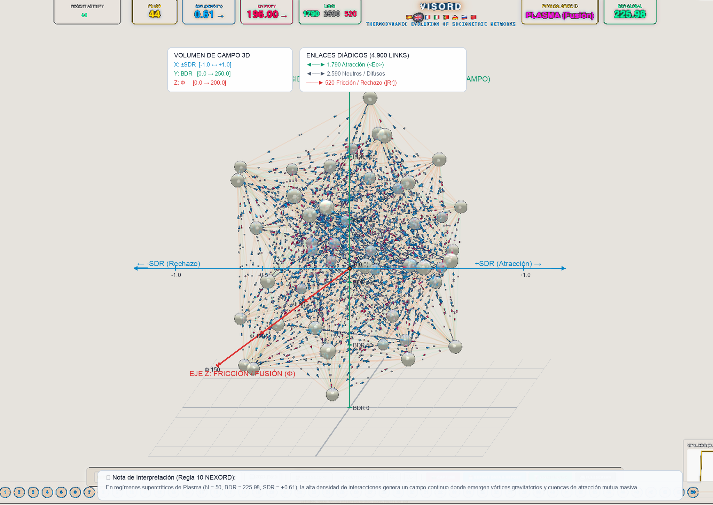

* **[EN]** Human collectives exhibit a surface layer of visible interaction (formal roles, explicit agreements, observable behavior) sustained by a deep, submerged relational foundation (unspoken expectations, latent tensions, unvoiced affinities, and subtle rejections). The core methodological aim is to **render visible and audible the dynamics and processes of group interaction**:
  * **Visual Dimension:** Deployed through graphical solutions and 3D continuous sociograms.
  * **Auditory Dimension (Hydrodynamic Sonification):** Translates friction gradients (Φ), net potential (SDR), and flow asymmetries into harmonic acoustic frequencies (calibrated at 432 Hz with distinct timbral textures). This auditory mapping allows researchers to listen to relational tension or harmony, providing a complementary perceptual modality for detecting dynamics submerged beneath the visible surface.

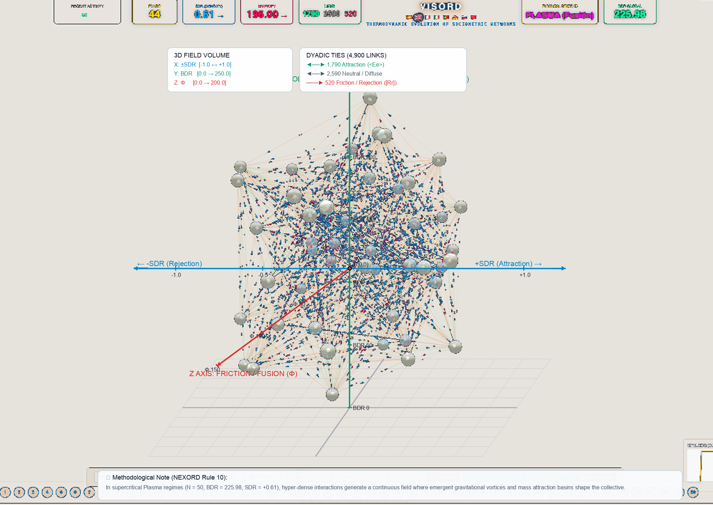

### 6.4. El Corpus CULTURAL como Laboratorio de Reactividad Cero / The CULTURAL Corpus as a Zero-Reactivity Laboratory
* **[ES]** A través de la categoría de datos CULTURAL, NEXORD transcribe obras maestras del cine, teatro y literatura a matrices sociométricas ordinales. Al tratarse de biografías relacionales completas, permiten auditar dinámicas extremas (como polarización o autoritarismo en obras de Lorca, Sartre o Rose) en un entorno experimental con reactividad evaluativa cero, sirviendo de contraste psicométrico robusto.
* **[EN]** Through the CULTURAL data category, NEXORD translates dramatic, cinematic, and narrative masterpieces into ordinal sociomatrices. Serving as complete relational records, literary corpora enable the forensic analysis of extreme dynamics (such as polarization or authoritarianism in works by Lorca, Sartre, or Rose) within an experimental framework with zero evaluation reactivity.

---

## 7. Gobernanza Institucional, Ética por Diseño y Ciencia Abierta / Governance, Ethics by Design & Open Science

### 7.1. Ética por Diseño y Uso No Punitivo / Ethics by Design & Non-Punitive Use
* **[ES]** La plataforma incorpora salvaguardas éticas en su propio diseño técnico (*Ethics by Design*). El sistema prohíbe explícitamente el uso de la sociometría para fines punitivos, listas de descarte o selección negativa. La ejecución sobre datos reales de campo (categoría REAL) requiere la autenticación y responsabilidad formal de un Investigador Principal (IP) acreditado.
* **[EN]** The platform embeds ethical safeguards directly into technical algorithms (*Ethics by Design*). The system explicitly prohibits punitive deployments, negative selection, or elimination rankings. Analysis on empirical field datasets (REAL category) requires authentication and formal accountability by an accredited Principal Investigator (PI).

### 7.2. Ciencia Abierta, Protocolo Clélie y Custodia Institucional (BSOC) / Open Science, Clélie Protocol & Institutional Custodianship
* **[ES]** En coherencia con los principios de Ciencia Abierta y Datos FAIR, la formulación matemática, metodológica y computacional de NEXORD es de acceso libre. La plataforma web interactiva completa, sus motores algorítmicos y los visualizadores tridimensionales VISORD están accesibles públicamente en la página web oficial del proyecto: [https://josemancor.github.io/nex-ord-web/](https://josemancor.github.io/nex-ord-web/). Para proteger la confidencialidad, los datos de campo se anonimizan bajo códigos formales canónicos (1A1a..5A1a) y se aseguran mediante sellado criptográfico inmutable (SHA3-512, Protocolo Clélie), bajo la custodia académica del Banco Sociométrico (BSOC / Universitat de Barcelona).
* **[EN]** In accordance with Open Science and FAIR Data principles, NEXORD's mathematical, methodological, and computational formulations are publicly accessible. The complete interactive web platform, computational engines, and 3D VISORD visualizers are openly accessible at the official web portal: [https://josemancor.github.io/nex-ord-web/](https://josemancor.github.io/nex-ord-web/). To protect participant confidentiality, empirical field datasets undergo canonical anonymization (1A1a..5A1a) and cryptographic hash sealing (SHA3-512, Clélie Protocol), under the academic custodianship of the Sociometric Data Bank (BSOC / University of Barcelona).

### 7.3. Derechos de los Participantes y Devolución Constructiva / Participant Rights & Constructive Feedback
* **[ES]** Los participantes disponen de claves temporales individuales para verificar la fidelidad del procesamiento de sus datos, sin acceso a información de terceros. La re-identificación de nodos queda reservada exclusivamente al IP responsable en contextos de orientación o apoyo psicológico. Toda devolución de resultados tiene carácter formativo, constructivo y no estigmatizante, orientada a favorecer la salud integral del colectivo. En investigaciones administradas a través de entornos web, la plataforma contempla como opción metodológica el despliegue del **Portal del Participante**, concebido como una garantía técnica de transparencia y fidelidad en la captura. Mediante credenciales individuales seguras y efímeras, cada integrante puede acceder a un entorno restringido para verificar la correcta recepción de sus propias respuestas, sin visibilidad alguna sobre las elecciones ni los ordenamientos emitidos por el resto de los miembros. Toda función de devolución individual, formativa o de apoyo grupal permanece supeditada en todo momento a la **custodia exclusiva y al criterio orientador del Investigador Principal (IP)**, salvaguardando la confidencialidad mutua y evitando cualquier exposición o juicio perjudicial entre pares.
* **[EN]** Participants receive individual codes to audit data processing fidelity without accessing peer records. Node re-identification is strictly restricted to the responsible PI within guidance or supportive group mediation. All feedback is constructive, non-stigmatizing, and dedicated to promoting collective health. In web-administered research settings, the platform optionally provides a **Participant Portal** designed as a technical safeguard for data fidelity and transparency. Through secure, ephemeral individual credentials, participants can access a restricted environment to audit the accurate capture of their own submissions, strictly without access to rankings or responses emitted by other peers. Any pedagogical feedback, guidance, or supportive reflection remains strictly under the **direct custodianship and professional mediation of the Principal Investigator (PI)**, preserving mutual confidentiality and precluding peer-to-peer exposure or harmful evaluation.

---

## 8. Anexos Técnicos Formalizados / Canonical Technical Annexes

### 8.1. Anexo I: Matrices Duales (SMIb / SMIa), Retícula Maestra Q81 y Catálogo I255 / Dual Matrices (SMIb/SMIa), Master 9x9 Lattice of Q81, and I255 Catalog
* **[ES]** 
  * **Matriz SMIb:** Registra en cada celda (i, j) el tetragrama numérico (A1 · A2 · A3 · A4) = (pDA · DA · RECIBE · pRECIBE).
  * **Matriz SMIa:** Condensa el tetragrama en las 81 figuras relacionales exhaustivas (1 = [Rr], 41 = ¡¿?!, 81 = <Ee>).
  * **Catálogo de Indicadores Booleanos I255:** Partición disyuntiva exhaustiva del espacio diádico a lo largo de la diagonal de consonancia perceptiva.
* **[EN]** 
  * **SMIb Matrix:** Stores the numerical tetragram (A1 · A2 · A3 · A4) = (pDA · DA · RECIBE · pRECIBE) in each cell (i, j).
  * **SMIa Matrix:** Condenses the tetragram into the 81 dyadic configurations (1 = [Rr], 41 = ¡¿?!, 81 = <Ee>).
  * **Boolean Indicator Catalog I255:** Disjunctive partitioning of dyadic space along the diagonal of perceptual consonance.

### 8.2. Anexo II: Métricas Factoriales (COR, CTA, CTR), Ejes Verticales Slender y Proyección 2D(6) / Factorial Quality Metrics (COR, CTA, CTR), Vertical Axes, and 2D(6) Projection
* **[ES]** 
  * **Métricas Factoriales (Cornejo, 1988):**
    * COR mide la calidad de representación del nodo i sobre el factor alfa.
    * CTA expresa el porcentaje de inercia factorial explicada por el elemento i.
    * CTR refleja la varianza acumulada explicada global.
  * **Ejes Factoriales Verticales:** Ejes esbeltos verticales que ordenan los elementos según su peso estructural, evitando la saturación gráfica de los diagramas de dispersión 2D habituales.

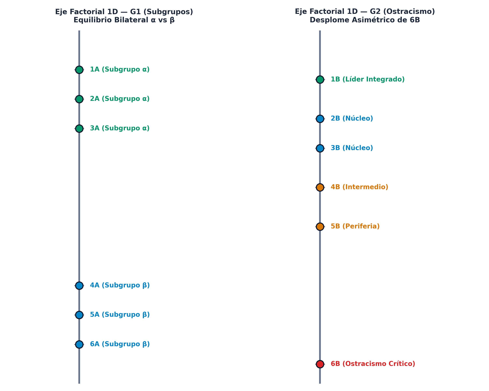

* **[EN]** 
  * **Factorial Metrics (Cornejo, 1988):**
    * COR measures representation quality of node i on factor alpha.
    * CTA expresses the percentage of factor inertia explained by element i.
    * CTR reflects global cumulative explained variance.
  * **Vertical Factorial Axes:** Slender vertical axes rank nodes by structural weight, preventing visual crowding in saturated 2D scatter plots.

### 8.3. Anexo III: Catálogo de los 10 Dominios Ecosistémicos / Catalog of the 10 Ecosystemic Domains
* **[ES]** NEXORD calibra la inercia relacional (alfa) y la tasa de decaimiento relacional (gamma) a lo largo de 10 dominios institucionales normativos (escolar, universitario, deportivo, sanitario, laboral, etc.):

* **[EN]** NEXORD calibrates Relational Inertia (alpha) and Relational Decay (gamma) across 10 normative institutional domains:

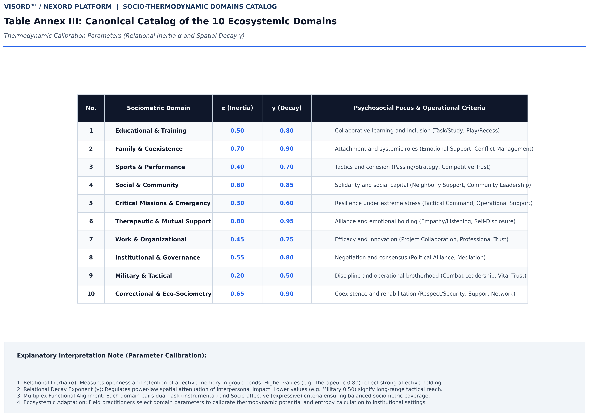

### 8.4. Anexo IV: Interdistancias de Rango Emisor-Receptor y Diagonal de Isometría / Sender - Receiver Rank Interdistances and Isometry Diagonal
* **[ES]** Distancias euclídeas para la emisión del dador (d_DA) y la recepción (d_RC), preservando el orden estricto de emisión:
  * **Diagonal de Isometría (d_DA = d_RC):** Evalúa la simetría relacional y verifica el Principio de Asimetría Relacional (la dispersión en recepción supera sistemáticamente a la dispersión en emisión).

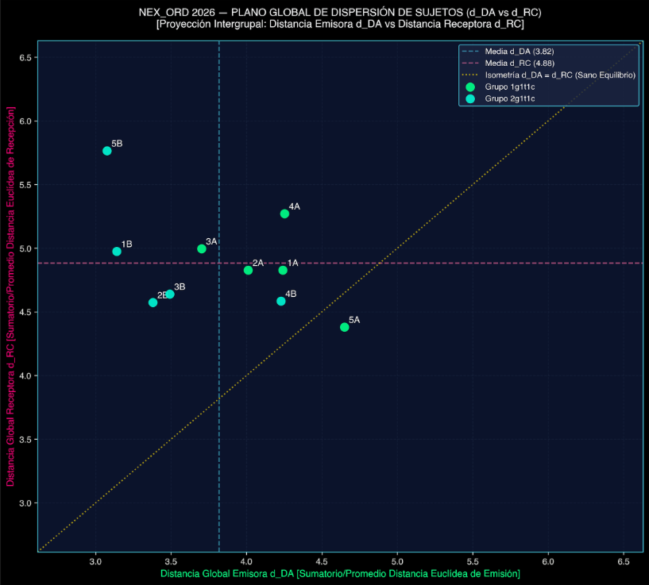

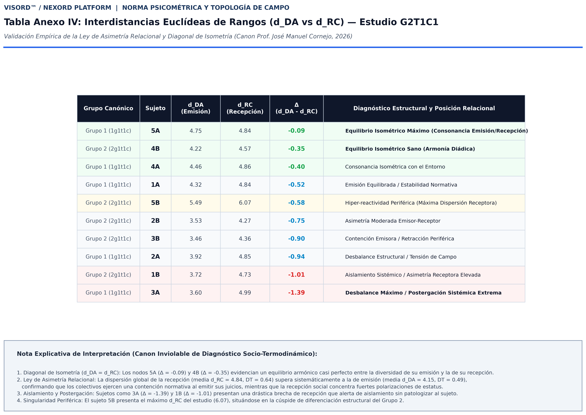

* **[EN]** Euclidean distances for sender emission (d_DA) and receiver reception (d_RC) preserving strict sender ordering:
  * **Isometry Diagonal (d_DA = d_RC):** Evaluates relational symmetry and verifies the Relational Asymmetry Principle (reception dispersion systematically exceeds emission dispersion).

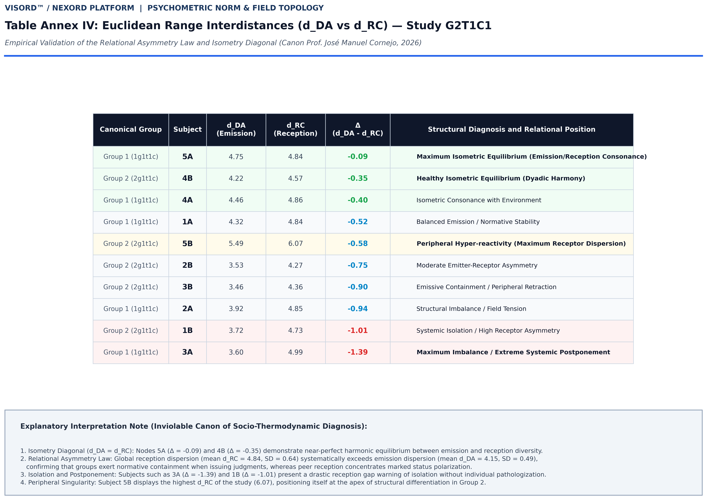

---

## 9. Referencias Bibliográficas / Canonical References

1. Absil, P.-A., Mahony, R., & Sepulchre, R. (2008). *Optimization algorithms on matrix manifolds*. Princeton University Press.
2. Aref, S., & Wilson, M. C. (2021). The frustration index is a key measure for analysing signed networks. *Journal of Complex Networks*, 7(2), cnz006. https://doi.org/10.1093/comnet/cnz006
3. Avramidis, E., Strogilos, V., Aroni, K., & Kankaraki, C. T. (2017). Using sociometric techniques to assess the social impacts of inclusion. *Educational Research Review*, 20, 68–80.
4. Bales, R. F. (1950). *Interaction process analysis: A method for the study of small groups*. Addison-Wesley.
5. Benzécri, J.-P. (1973). *L'Analyse des Données: T. 2, L'Analyse des Correspondances*. Dunod.
6. Borsboom, D., et al. (2021). Network analysis of multivariate data in psychological science. *Nature Reviews Methods Primers*, 1(1), 58.
7. Cornejo, J. M. (1988). *Técnicas de investigación social: El análisis de correspondencias*. PPU.
8. Cornejo, J. M. (2026). *Computational Ordinal Sociometry (NEXORD): An Algorithmic, Matrix, and 4D Socio-Thermodynamic Framework*. Zenodo. https://doi.org/10.5281/zenodo.18926396
9. Cucuringu, M., Mantzaris, A. V., & Roberts, J. (2023). The Bradley-Terry stochastic block model for directed ranking networks. *Journal of Complex Networks*, 11(4), cnad025. https://doi.org/10.1093/comnet/cnad025
10. Diaz-Diaz, F., & Estrada, E. (2025). Signed graphs in data sciences via communicability geometry. *Information Sciences*, 680, 121110. https://doi.org/10.1016/j.ins.2024.121110
11. Festinger, L. (1950). Informal social communication. *Psychological Review*, 57(5), 271–282.
12. Heider, F. (1958). *The psychology of interpersonal relations*. John Wiley & Sons.
13. Janis, I. L. (1972). *Victims of Groupthink: A psychological study of foreign-policy decisions and fiascoes*. Houghton Mifflin.
14. Kenny, D. A., & Garcia, R. L. (2012). Using the Actor–Partner Interdependence Model to study the effects of group composition. *Small Group Research*, 43(4), 468–496.
15. Krivitsky, P. N., & Butts, C. T. (2017). Exponential-family random graph models for rank-order relational data. *Sociological Methodology*, 47(1), 68–112. https://doi.org/10.1111/socm.12038
16. Lewin, K. (1951). *Field theory in social science: Selected theoretical papers*. Harper & Row.
17. Morales Domínguez, J. F., & Cornejo Álvarez, J. M. (2026). Sociometría Ordinal Computacional. La Plataforma NEXORD: Hacia una Física de lo Grupal. *Psicothema* (en revisión).
18. Moreno, J. L. (1934). *Who shall survive? A new approach to the problem of human interrelations*. Nervous and Mental Disease Publishing Co.
19. Nicolis, G., & Prigogine, I. (1977). *Self-organization in nonequilibrium systems: From dissipative structures to order through fluctuations*. John Wiley & Sons.
20. Scudéry, M. de (1654). *Clélie, histoire romaine*. Augustin Courbé.
21. Terry, R. (2000). Recent advances in measurement theory and the use of sociometric techniques. In A. H. N. Cillessen & W. M. Bukowski (Eds.), *Recent advances in the measurement of acceptance and rejection in the peer system* (pp. 27–48). Jossey-Bass. https://doi.org/10.1002/cd.23220008804
22. Tsankova, E., & Tair, E. (2021). Meta-accuracy in sociometric status perceptions. *Frontiers in Psychology*, 12, 642398.
23. Vicente, R., Cornejo, J. M., & Barbero, F. (2006). Análisis de la Actividad Grupal (AAG). *Psicothema*, 18(3), 445–452.
24. Ye, K., & Lim, L.-H. (2016). Schubert varieties and distances on Grassmann manifolds. *SIAM Journal on Matrix Analysis and Applications*, 37(3), 1176–1197.

---

*(C) 2026 Dr. José Manuel Cornejo Álvarez / Plataforma NEXORD (VISORD) / Banco Sociométrico BSOC / Universitat de Barcelona.*  
*Publicado bajo licencia Creative Commons Reconocimiento-NoComercial-SinObraDerivada 4.0 Internacional (CC BY-NC-ND 4.0).*
